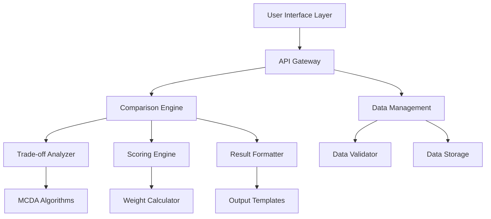

# Design Document: Option Comparison Tool

## Overview

The Option Comparison Tool is a decision-support system that helps users evaluate multiple alternatives through structured trade-off analysis. Rather than providing definitive recommendations, the system empowers users to make informed choices by presenting comprehensive comparisons based on their specific constraints and priorities.

### Scope and Vision
- **Primary Domain**: Technology decision-making (APIs, cloud services, frameworks, tools)
- **Target Users**: Technical professionals (developers, architects, product managers) with varying MCDA expertise
- **MVP Focus**: Comparing 2-10 technology options across 3-15 criteria with guided weighting

### MCDA Method Support
- **Phase 1**: Weighted Sum Model (WSM) with normalization
- **Future Phases**: TOPSIS, Simple Multi-Attribute Rating Technique (SMART)
- **Method Selection**: System-selected based on data characteristics, transparent to users
- **Rationale**: WSM provides interpretable results while avoiding "apples to oranges" issues through proper normalization

### Normalization Strategy
- **Benefit Criteria** (higher is better): `(value - min) / (max - min)`
- **Cost Criteria** (lower is better): `(max - value) / (max - min)`
- **Missing Values**: Excluded from criterion normalization, option penalized via reduced confidence score
- **Outlier Handling**: Values capped at 95th/5th percentile thresholds before normalization
- **Zero Range**: When max = min, all options receive score of 0.5 for that criterion
- **Criterion Classification**: Users specify whether each attribute is benefit/cost/neutral during constraint setup
- **Transparency**: All normalization parameters (min, max, outlier thresholds) displayed in results

### Key Design Principles
1. **Transparency Over Optimization**: All scoring logic must be explainable
2. **Guided Decision-Making**: Provide structured guidance without declaring winners
3. **Progressive Complexity**: Simple interface with advanced options available
4. **Data Quality Awareness**: Surface confidence levels and data limitations

## Architecture

The system follows a modular architecture with clear separation of concerns:



### Core Principles

1. **Transparency**: All scoring and trade-off logic is explainable
2. **Flexibility**: Support multiple decision-making methodologies
3. **User-Centric**: Adapt to user priorities rather than imposing fixed criteria
4. **Extensibility**: Easy to add new comparison types and algorithms

## Components and Interfaces

### 1. Option Management Component

**Purpose**: Handle creation, validation, and storage of comparison options

**Key Classes**:
- `Option`: Represents a single choice with attributes and metadata
- `OptionValidator`: Ensures data completeness and consistency
- `OptionRepository`: Manages option persistence and retrieval

**Interface**:
```typescript
interface Option {
  id: string;
  name: string;
  description: string;
  attributes: Record<string, AttributeValue>;
  metadata: OptionMetadata;
}

interface OptionManager {
  addOption(option: Option): Promise<void>;
  removeOption(id: string): Promise<void>;
  validateOption(option: Option): ValidationResult;
  getOptions(): Promise<Option[]>;
}
```

### 2. Constraint Definition Component

**Purpose**: Capture and manage user constraints and priorities

**Key Classes**:
- `Constraint`: Represents a requirement or preference
- `ConstraintType`: Enumeration of constraint categories (budget, performance, etc.)
- `PriorityWeights`: Manages relative importance of different criteria

**Interface**:
```typescript
interface Constraint {
  id: string;
  type: ConstraintType;
  description: string;
  isHardRequirement: boolean;
  weight: number; // 0-1 scale, will be normalized if sum ≠ 1
  evaluationCriteria: EvaluationCriteria;
}

interface ConstraintManager {
  addConstraint(constraint: Constraint): void;
  updateWeights(weights: Record<string, number>): WeightValidationResult;
  validateConstraints(): ValidationResult;
  normalizeWeights(weights: Record<string, number>): NormalizedWeights;
}

interface WeightValidationResult {
  isValid: boolean;
  normalizedWeights: Record<string, number>;
  warnings: string[]; // e.g., "Weights auto-normalized", "High concentration detected"
  suggestions: string[]; // e.g., "Consider balancing cost vs performance"
}
```

### 3. Comparison Engine Component

**Purpose**: Core logic for analyzing options and generating trade-offs

**Key Classes**:
- `ComparisonEngine`: Main orchestrator for comparison logic
- `TradeoffAnalyzer`: Identifies pros, cons, and key differentiators
- `ScoringEngine`: Calculates weighted scores using MCDA methods
- `DecisionMatrix`: Structured representation of comparison results

**Interface**:
```typescript
interface ComparisonEngine {
  compareOptions(options: Option[], constraints: Constraint[]): ComparisonResult;
  generateTradeoffs(options: Option[]): TradeoffAnalysis;
  calculateScores(options: Option[], weights: WeightVector): ScoreMatrix;
}

interface ComparisonResult {
  matrix: DecisionMatrix;
  tradeoffs: TradeoffAnalysis;
  insights: DecisionInsight[];
  confidence: ConfidenceMetrics;
}
```

### 4. Presentation Layer Component

**Purpose**: Format and display comparison results in multiple views

**Key Classes**:
- `MatrixRenderer`: Creates side-by-side comparison tables
- `InsightGenerator`: Produces summary insights and recommendations
- `ExportManager`: Handles multiple output formats

**Interface**:
```typescript
interface PresentationManager {
  renderMatrix(result: ComparisonResult): MatrixView;
  generateInsights(result: ComparisonResult): InsightSummary;
  exportResults(result: ComparisonResult, format: ExportFormat): ExportData;
}
```

## Data Models

### Option Data Sources and Management
- **Phase 1**: Fully user-entered options with structured attribute templates
- **Future Phases**: Integration with external APIs (AWS/Azure pricing, GitHub API data)
- **Templates**: Predefined attribute schemas for common comparison types (cloud services, APIs, frameworks)
- **Versioning Strategy**: 
  - **Options**: Simple timestamp-based versioning (no complex branching)
  - **Comparisons**: Immutable snapshots with option data frozen at comparison time
  - **Historical Fidelity**: Past comparisons remain valid even if underlying option data changes

### Comparison Snapshot Model
```typescript
interface ComparisonSnapshot {
  id: string;
  name: string;
  createdAt: Date;
  createdBy: string;
  optionSnapshots: OptionSnapshot[]; // Frozen option data at comparison time
  constraints: Constraint[];
  results: ComparisonResult;
  metadata: {
    version: string; // Semantic version of comparison format
    algorithmVersion: string; // MCDA algorithm version used
    dataIntegrityHash: string; // Verify snapshot hasn't been tampered with
  };
}

interface OptionSnapshot {
  originalOptionId: string;
  snapshotData: Option; // Complete option data at time of comparison
  dataVersion: Date; // When this option data was last modified
}
```

### Option Model
```typescript
interface Option {
  id: string;
  name: string;
  description: string;
  category: 'api' | 'cloud-service' | 'framework' | 'tool' | 'custom';
  attributes: {
    [key: string]: {
      value: string | number | boolean;
      unit?: string;
      confidence?: number; // 0-1, based on data source reliability
      source?: string; // URL or reference to data source
      lastUpdated?: Date;
    };
  };
  metadata: {
    dateAdded: Date;
    lastUpdated: Date;
    dataQuality: QualityScore;
    entryMethod: 'manual' | 'template' | 'api'; // How this option was created
  };
}
```

### Constraint Model
```typescript
interface Constraint {
  id: string;
  name: string;
  type: 'budget' | 'performance' | 'compatibility' | 'feature' | 'custom';
  isHardRequirement: boolean;
  weight: number; // 0-1 scale, validated to ensure sum ≤ 1
  criterionType: 'benefit' | 'cost' | 'neutral'; // For normalization
  evaluationRule: {
    attributePath: string; // e.g., "pricing.monthlyFee"
    operator: 'lessThan' | 'greaterThan' | 'equals' | 'contains' | 'range';
    targetValue: string | number | [number, number];
    unit?: string;
  };
  description: string;
  confidenceLevel: number; // 0-1 based on data quality
}
```

### Evaluation Function Specification
- **No Custom Code**: Users define constraints through declarative rules only
- **Predefined Operators**: System provides safe, validated comparison operators
- **Attribute Mapping**: Constraints reference specific option attributes by path
- **Validation**: All evaluation rules are validated for safety and correctness

### Weight Validation and Guidance Strategy
- **Weight Range**: Each weight ∈ [0, 1] representing relative importance
- **Sum Handling**: 
  - If sum = 1: Use weights as-is
  - If sum < 1: Auto-normalize to sum to 1, display warning about adjustment
  - If sum > 1: Reject and require user correction
- **Skew Detection**: Warn when any single weight > 0.6 (potential over-concentration)
- **Equal Weighting Fallback**: If no weights provided, distribute equally across all criteria
- **Guided Redistribution**: Provide slider interface with real-time sum display and suggestions
- **Transparency**: Always show final normalized weights used in calculation

### Hard Constraint Handling
- **Default Behavior**: Options violating hard constraints are excluded from scoring and ranking
- **Visibility Control**: UI toggle "Include excluded options for comparison (flagged)"
- **Excluded Option Display**: 
  - Shown with zero score and clear violation explanation
  - Marked with warning indicators in comparison matrix
  - Listed in separate "Excluded Options" section with violation reasons
- **User Override**: Users can temporarily include excluded options to understand why they were filtered
- **Transparency**: All constraint evaluations and exclusion reasons are logged and displayed
```

### Decision Matrix Model
```typescript
interface DecisionMatrix {
  options: Option[];
  excludedOptions: ExcludedOption[]; // Options that failed hard constraints
  criteria: Constraint[];
  scores: number[][]; // [option][criterion] - only for included options
  normalizedScores: number[][];
  weightedScores: number[];
  rankings: RankingResult[];
  constraintViolations: ConstraintViolation[];
}

interface ExcludedOption {
  option: Option;
  violatedConstraints: ConstraintViolation[];
  canBeIncluded: boolean; // User toggle state
}

interface ConstraintViolation {
  constraintId: string;
  constraintName: string;
  expectedValue: any;
  actualValue: any;
  explanation: string;
}
```

### Trade-off Analysis Model
```typescript
interface TradeoffAnalysis {
  optionAnalyses: {
    [optionId: string]: {
      strengths: AnalysisPoint[];
      weaknesses: AnalysisPoint[];
      uniqueFeatures: AnalysisPoint[];
      dealBreakers: AnalysisPoint[];
    };
  };
  keyDifferentiators: Differentiator[];
  scenarioGuidance: ScenarioGuidance[]; // Note: guidance, not recommendations
}

interface AnalysisPoint {
  description: string;
  attributeSource: string; // Which attribute this is derived from
  confidenceLevel: number; // 0-1 based on data quality
  reasoning: string; // Rule-based explanation of how this was determined
  ruleApplied: string; // e.g., "HighestValue", "LowestCost", "UniqueFeature"
}

interface ScenarioGuidance {
  scenario: string; // e.g., "Budget-constrained projects"
  guidance: string; // e.g., "Consider focusing on cost-effectiveness over premium features"
  applicableOptions: string[]; // Option IDs that fit this scenario
  tradeoffExplanation: string; // What you gain/lose in this scenario
  confidenceLevel: number;
}

interface Differentiator {
  attribute: string;
  description: string;
  optionValues: Record<string, any>; // optionId -> value
  significance: 'high' | 'medium' | 'low';
}
```

### Analysis Logic Specification
- **Strengths/Weaknesses**: Rule-based analysis comparing each option's attributes to the group average and user constraints
- **Unique Features**: Attributes where an option significantly differs from others (>20% variance)
- **Deal Breakers**: Hard constraint violations or critical missing features
- **No AI/LLM**: All analysis uses deterministic rules and statistical comparisons

### Confidence Metrics Definition
```typescript
interface ConfidenceMetrics {
  overall: number; // 0-1, weighted average of component confidences
  dataCompleteness: number; // Percentage of attributes with values
  dataFreshness: number; // Based on last update timestamps
  sourceReliability: number; // Based on data source trustworthiness
  algorithmCertainty: number; // How clear the ranking differences are
}
```

## Non-Functional Requirements

### Performance Requirements
- **Comparison Latency**: Results for up to 10 options × 15 criteria must render within 2 seconds
- **Progressive Loading**: Comparisons with >50 data points use progressive rendering
- **Concurrent Users**: Support 100 concurrent comparisons without degradation
- **Memory Usage**: Limit to 512MB per comparison session

### Security and Privacy
- **Authentication**: OAuth 2.0 integration for user accounts
- **Data Classification**: Support for marking comparisons as confidential/internal/public
- **Access Control**: Role-based permissions for viewing and editing shared comparisons
- **Audit Trail**: Log all comparison creation, modification, and sharing events
- **Data Retention**: Configurable retention policies for comparison history
- **Immutable Snapshots**: Comparison results cannot be modified after creation
- **Data Integrity**: Cryptographic hashes verify snapshot authenticity
- **Version Tracking**: All algorithm and data versions recorded for reproducibility

### Scalability and Reliability
- **Horizontal Scaling**: Stateless architecture supporting load balancing
- **Graceful Degradation**: Fallback to simplified analysis if primary algorithms fail
- **Data Backup**: Automated backup of comparison data and user preferences
- **Error Recovery**: Automatic retry mechanisms for transient failures

### Usability and Accessibility
- **Progressive Disclosure**: Simple interface with advanced options available on demand
- **Guided Workflows**: Step-by-step wizards for first-time users
- **WCAG 2.1 AA Compliance**: Full accessibility support including screen readers
- **Responsive Design**: Optimized for desktop, tablet, and mobile viewing
- **Internationalization**: Support for multiple languages and locales

### Deployment Architecture
- **Target Environment**: Cloud-native SaaS application
- **Expected Scale**: 1,000+ users, 10,000+ comparisons per month
- **Integration Points**: REST API for embedding in other tools
- **Monitoring**: Application performance monitoring and user analytics

### API Surface Definition
```typescript
// Read-Only APIs (for embedding and integration)
GET /v1/comparisons/{id}           // Retrieve comparison snapshot
GET /v1/comparisons/{id}/export    // Export in various formats
GET /v1/templates                  // Get option templates by category

// Write APIs (for full integration)
POST /v1/comparisons               // Create new comparison
PUT /v1/comparisons/{id}/options   // Update options in draft comparison
POST /v1/comparisons/{id}/execute  // Run comparison analysis

// Interactive APIs (for real-time embedding)
POST /v1/compare/preview           // Quick comparison without persistence
GET /v1/options/validate           // Validate option data structure
POST /v1/constraints/evaluate      // Test constraint rules
```

### API Versioning Strategy
- **URL Versioning**: `/v1/`, `/v2/` for major breaking changes
- **Backward Compatibility**: v1 maintained for 2+ years after v2 release
- **Feature Flags**: New features introduced via optional parameters
- **Deprecation Policy**: 6-month notice for endpoint deprecation
- **Export Formats**: Versioned separately (`?format=json&version=1.2`)

## Correctness Properties

*A property is a characteristic or behavior that should hold true across all valid executions of a system—essentially, a formal statement about what the system should do. Properties serve as the bridge between human-readable specifications and machine-verifiable correctness guarantees.*

### Property 1: Data Round-trip Consistency
*For any* option with valid attributes, adding it to the system and then retrieving it should return an equivalent option with all attributes preserved
**Validates: Requirements 1.1, 1.5, 7.4**

### Property 2: Input Validation Consistency  
*For any* input data (options, constraints, or configuration), the system should consistently validate completeness and reject invalid inputs while accepting valid ones
**Validates: Requirements 1.2, 2.4, 6.1**

### Property 3: Minimum Options Enforcement
*For any* comparison request, the system should require at least two options and reject attempts to compare fewer options
**Validates: Requirements 1.3**

### Property 4: Structured Input Support
*For any* valid structured input (name, description, attributes), the system should successfully create an option with all provided information
**Validates: Requirements 1.4**

### Property 5: Constraint Type Support
*For any* supported constraint type (budget, performance, compatibility), the system should correctly store and process constraints of that type
**Validates: Requirements 2.1, 2.2**

### Property 6: Weight Application Consistency
*For any* set of options and priority weights, changing the weights should predictably influence both comparison analysis and trade-off results
**Validates: Requirements 2.3, 2.5**

### Property 7: Comprehensive Analysis Generation
*For any* set of options being compared, the system should generate pros, cons, and key differentiators for each option
**Validates: Requirements 3.1, 3.2**

### Property 8: Constraint Evaluation Accuracy
*For any* option and constraint combination, the system should correctly evaluate how well the option meets the constraint
**Validates: Requirements 3.3**

### Property 9: Trade-off Identification
*For any* set of options with different attribute values, the system should identify and highlight meaningful trade-offs between aspects
**Validates: Requirements 3.4**

### Property 10: Consistent Output Format
*For any* comparison result, the output should be in a structured, side-by-side matrix format containing both quantitative scores and qualitative explanations
**Validates: Requirements 3.5, 4.1, 4.2**

### Property 11: Insight Generation Completeness
*For any* comparison, the system should provide summary insights highlighting significant trade-offs and scenario-based recommendations
**Validates: Requirements 4.3, 5.1**

### Property 12: Visual Indicator Application
*For any* comparison where differences exist between options, the system should apply appropriate visual indicators to highlight those differences
**Validates: Requirements 4.4**

### Property 13: Aspect Filtering Functionality
*For any* comparison result and any valid aspect, the system should allow users to focus on that specific aspect
**Validates: Requirements 4.5**

### Property 14: Ambiguity Handling
*For any* comparison where no clear winner exists, the system should explain the dependency on user priorities rather than making absolute recommendations
**Validates: Requirements 5.2, 5.5**

### Property 15: Critical Issue Identification
*For any* option in a comparison, the system should identify and highlight any deal-breakers or critical considerations
**Validates: Requirements 5.3**

### Property 16: Guidance Provision
*For any* comparison, the system should suggest relevant follow-up questions or additional research areas
**Validates: Requirements 5.4**

### Property 17: Data Quality Management
*For any* data in the system, outdated or potentially inaccurate information should be flagged without breaking functionality
**Validates: Requirements 6.2, 6.5**

### Property 18: Confidence and Transparency
*For any* analysis or assessment, the system should provide confidence levels and sources or reasoning for the results
**Validates: Requirements 6.3, 6.4**

### Property 19: Complete Export Functionality
*For any* comparison result, exporting in any supported format should include all relevant context (constraints, weights, timestamps) and maintain data integrity
**Validates: Requirements 7.1, 7.2**

### Property 20: Secure Sharing
*For any* comparison with sharing enabled, the system should generate valid shareable links while maintaining appropriate data privacy and access controls
**Validates: Requirements 7.3, 7.5**

<function_calls>
<invoke name="prework">
<parameter name="featureName">option-comparison-tool

## Error Handling

### Input Validation Errors
- **Invalid Option Data**: Return structured error messages indicating missing or invalid fields
- **Insufficient Options**: Prevent comparison attempts with fewer than 2 options
- **Invalid Constraints**: Reject constraints that cannot be measured or evaluated
- **Malformed Weights**: Normalize or reject weight vectors that don't sum appropriately

### Data Quality Issues
- **Missing Attributes**: Use graceful degradation, indicating confidence reduction
- **Outdated Information**: Flag with warnings but allow comparison to proceed
- **Inconsistent Data**: Highlight inconsistencies in comparison results
- **Source Reliability**: Include confidence indicators based on data source quality

### System Errors
- **Analysis Failures**: Provide fallback comparison methods when primary algorithms fail
- **Export Errors**: Retry with alternative formats or simplified data sets
- **Storage Failures**: Implement data recovery and backup mechanisms
- **Performance Issues**: Implement timeouts and progressive loading for large comparisons

### User Experience Errors
- **Overwhelming Complexity**: Provide simplified views and guided workflows
- **Unclear Results**: Include explanatory text and contextual help
- **Decision Paralysis**: Offer filtering and prioritization tools
- **Accessibility Issues**: Ensure screen reader compatibility and keyboard navigation

## Testing Strategy

### Dual Testing Approach

The system will employ both unit testing and property-based testing to ensure comprehensive coverage:

**Unit Tests** focus on:
- Specific examples that demonstrate correct behavior
- Edge cases and boundary conditions  
- Integration points between components
- Error handling scenarios
- User interface interactions

**Property-Based Tests** focus on:
- Universal properties that hold across all valid inputs
- Comprehensive input coverage through randomization
- Correctness properties defined in this design document
- Data consistency and integrity across operations

### Property-Based Testing Configuration

- **Testing Framework**: Use QuickCheck-style property testing library appropriate for chosen implementation language
- **Test Iterations**: Minimum 100 iterations per property test to ensure statistical confidence
- **Test Tagging**: Each property test must reference its corresponding design property using the format: **Feature: option-comparison-tool, Property {number}: {property_text}**
- **Generator Strategy**: Implement smart generators that create realistic test data within valid input domains

### Key Testing Areas

1. **Data Integrity Testing**
   - Round-trip consistency for all data operations
   - Constraint application accuracy
   - Weight calculation correctness

2. **Algorithm Validation**
   - MCDA algorithm implementations
   - Trade-off analysis accuracy
   - Scoring consistency across different input sets

3. **User Interface Testing**
   - Comparison table rendering accuracy
   - Export functionality completeness
   - Accessibility compliance

4. **Performance Testing**
   - Response times for various comparison sizes
   - Memory usage with large datasets
   - Concurrent user handling

### Test Data Strategy

- **Synthetic Data Generation**: Create realistic options and constraints for testing
- **Edge Case Coverage**: Include boundary conditions, empty sets, and extreme values
- **Real-world Scenarios**: Test with actual comparison use cases (APIs, cloud services, etc.)
- **Adversarial Testing**: Include malformed inputs and stress conditions

The testing strategy ensures that each correctness property is validated through automated property-based tests while unit tests provide concrete examples and verify specific integration scenarios.